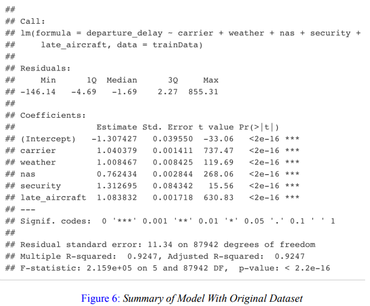
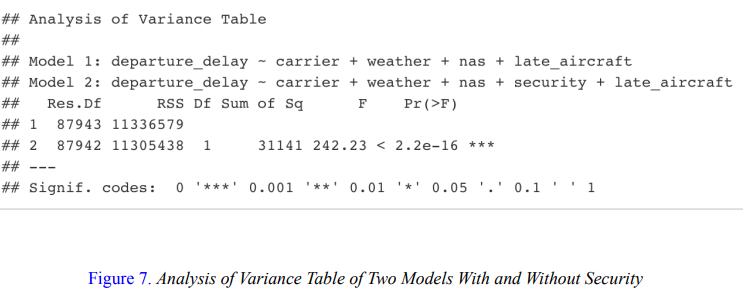
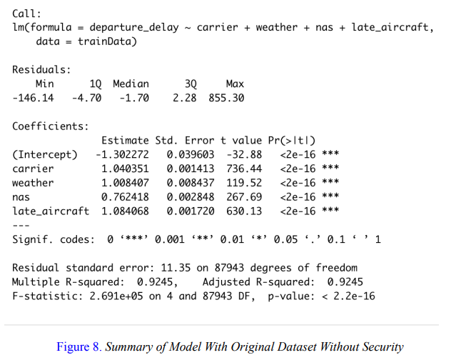
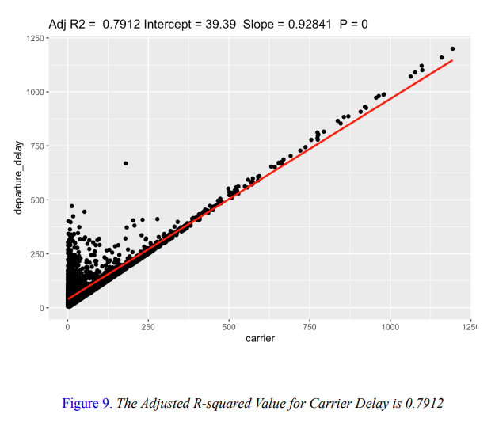
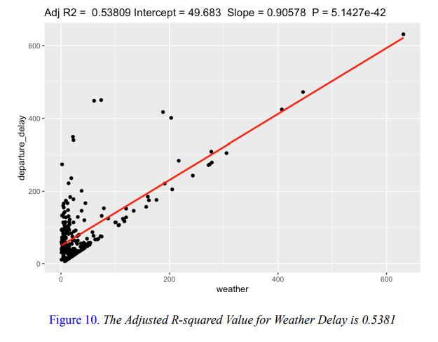
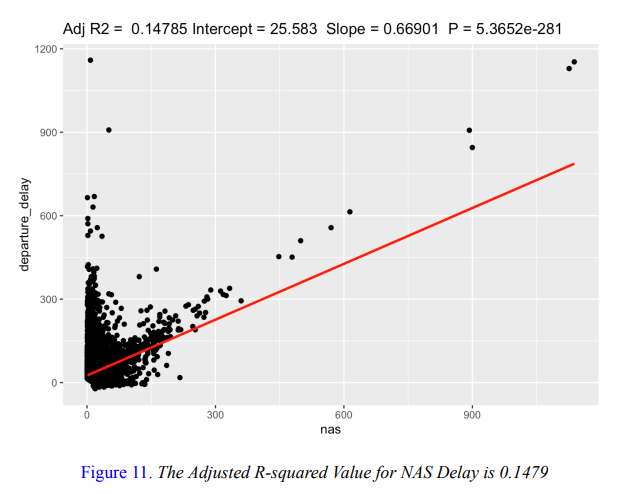
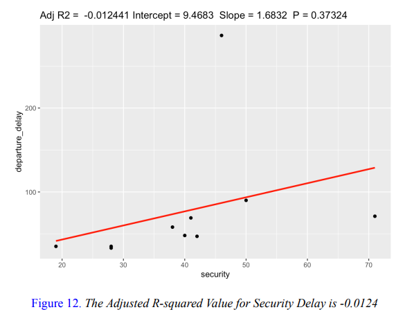
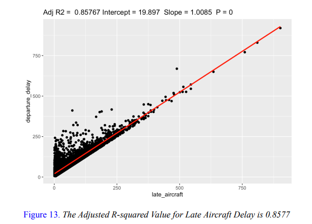
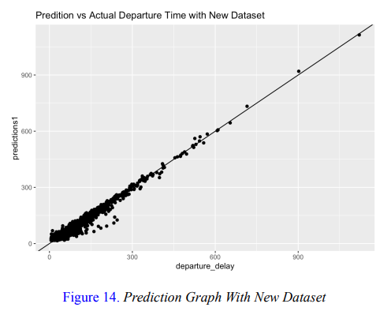
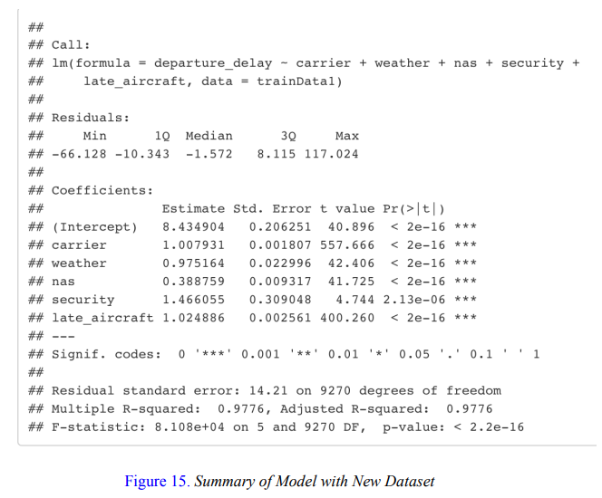

# Predicting and Analyzing Causes of Delay for Flight Departures : Project Overview

## Abstract

Paired with a growing population is a demand for travel. In my study, I closely examined airline
departure times by comparing their scheduled and actual departure times. I considered a delay to be any
difference of 15 minutes or more and recorded the cause of the delay. To ensure a fair assessment of each
airline’s performance, I collected data from a single airport every day for 10 years. By applying the
knowledge I acquired in class, I used R to employ linear regression, trained a mathematical model and
optimized it with least squares to create training and testing sets. By utilizing mathematical analysis
through T values, P values, and R-squared values, my results offer valuable insights into airline
performance regarding flight departures. My model can be used to predict future performance and analyze
past data to identify the most common causes of delay in departure statistics. A valuable resource that can
help both airline companies and consumers. This is proven when I practiced my model on departing
flights from Delta Airlines at the San Francisco International Airport from January 2013 until 2023, and
recognized that flight carrier delay and late arriving aircraft were the biggest causes of delays, suggesting
that it is well within an airline’s control to improve their on-time performance.

## Introduction
There is a growing interest in understanding and quantifying flight delays, as evidenced by the
increasing number of studies on this topic. These studies have utilized various statistical methods to
analyze arrival delays at airports and compare the performance of airlines and airports. For example, one
study analyzed ground delays and air holding at Entebbe International Airport over a five-year period and
generated daily probabilities for aircraft departure and arrival delays(Wesonga, Nabugoomu, & Jehopio,
2012). This study established a method for comparing both mean delay and extreme events among
airlines and airports, identifying a power-law decay of large delays. In other words, these studies
examined the factors contributing to flight delays in 2016 using data from the Bureau of Transportation
Statistics. Through reading other reports, I pinpointed that researchers employed machine learning
techniques and statistical models to create a predictive modeling engine capable of identifying delays in
advance. This indicated that various statistical methods were utilized in order to predict future data, and I
found this intriguing. Such research offers valuable insights into the causes of flight delays and serves as
inspiration for further investigation in this area. With this in mind, my team had a solid foundation with a
scope of what I wanted to pursue. I wanted to utilize the knowledge I acquired in class and apply that to
such a relevant issue. Through conducting this literature review, I had the opportunity to recognize that
various reports covered this relevant issue in their own approach. In hopes that I would be able to provide
further insight into the underlying issues behind flight delays, I found myself growing with curiosity on
how I would approach my model.

When coming up with my model, I wanted to examine a growing issue and how it personally
relates to us. So, I decided to focus on travel as we have all experienced the frustration and inconvenience
caused by a flight delay. In recent years, the global population growth has led to an unprecedented demand for air travel for various purposes such as business, leisure, and family. This increase in demand
necessitates the scheduling of more flights, raising concerns about the ability of airline companies to
maintain on-time performance. Flight delays can negatively impact customer loyalty.

Initially, I aimed to model the primary concerns of frequent air travelers by analyzing the air
travel consumer report, which details the most common consumer complaints for each airline company
such as lost luggage, refunds, etc. However, this approach only allowed me to analyze said data as a
whole and identify the most significant factors on a yearly basis. Specifically, I used this approach with
Markov Chains, but weren’t able to define transition matrices that would portray information that would
be valuable as time passes. For example, the probability of a number of complaints for a specific airline
based on a certain amount of time. I instead wanted to be able to have a more detailed approach on a
specific issue so I shifted my focus to one of the leading causes of consumer complaints - flight delays.
That is why I instead set my sights on a mathematical model that would be done through linear regression.
Once I examined closely at the statistics regarding flight delays in recent years, I distinguished that there
was merely a 79.96% statistic of on-time flights for major U.S. carriers in November 2022(Bureau of
Transportation). This data is publicly available information from a government resource, the bureau of
transportation, and this is what certainly propelled my motivation for building my model. My interest was
piqued and I began to get curious about the underlying patterns and trends. Why are flights not departing
on time? What’s the biggest cause and if so, is there a relationship? How could this be
addressed/improved?

As I was consuming information of detailed statistics on departures, I aimed towards
constructing a mathematical model that would offer valuable insights to both airline companies and
consumers on their departure performance. By evaluating performance of airline companies, this indicates
that they would gain the ability to discern the factors that impact their on-time performance. For example,
this would allow a company to be able to justify investing more of their time and resources into
improving specific issues. To improve their evaluation on timeliness on departing flights, if their largest
contributing factor to delayed flights are problems revolving around the crew and scheduling flights, they would know where to focus on. Furthermore, this model’s significance goes hand in hand with customers
as well. If an airline’s performance were to be improved, then customers would have a more confident
choice in being able to choose an airline that has a good performance record. Over time, this would build
customer loyalty and benefit both the company and the consumer.

So in order to address this issue, I decided to examine the overall causes of delays by reporting
operating carriers. By examining data from major U.S. flight carriers, there were a myriad of reasoning
behind each delay. Air carrier delay would be due to circumstances within the airline’s control and this
could be related to maintenance or crew problems, etc. Extreme weather delay is due to significant
weather conditions that in the judgment of the carrier, delays the operation of the flight. National Aviation
System Delay is caused by non-extreme weather conditions, such as airport operations, heavy air traffic
volume, etc. Security delay is caused by security issues such as evacuation situations, security breaches,
long lines at screening areas,etc. Lastly, late arriving aircraft delay which suggests that a previous flight
arrived late, forcing the present flight to depart late. This is why the assumptions for my model will be
that I will be predicting flight departure times, based on these causes of delays as my only predictors for
my model. To make the assumptions for my model more fair, I utilized data on the same airport. By
choosing to only take into account flights that departed from the San Francisco International Airport, for
every day from January 2013 to January 2023, I would be able to determine weather delays as a more fair
assessment. I also chose San Francisco International Airport due to how it has abundant flights departing
everyday, so I could input plenty of data.

Furthermore, in order to predict departure data based on historical flight performance, I wanted
to focus on evaluating an air carrier that performed well in departing flights on-time. This is why I wanted
to concentrate my model around Delta Airlines. Based on the data from the Bureau of Transportation
from 2022, Delta Airlines had one of the highest total records of flights in the U.S. paired with
consistently departing on time, at an impressive rate of 89.91%(Bureau of Transportation). Once my
model is utilized, it would be extremely significant as it would have the ability to accurately assess the
performance of Delta Airlines, predict future performance, and identify the biggest factors that contribute to flight delays. By identifying these factors, I can recognize if Delta Airlines has room for even further
improvement. Hence, my mathematical model holds considerable importance for both the airline and its
customers in improving the flying experience

## Approach to the Mathematical Model

In the realm of predicting flight delays, the primary goal of my mathematical model was to develop a predictive tool that could efficiently capture the underlying patterns in the dataset and establish a clear relationship between the input features and the output (departure delay). The choice of the appropriate mathematical model was crucial to ensure accurate predictions and to gain valuable insights into the factors influencing flight delays. Drawing inspiration from the principles outlined in CSE 176's (Introduction to Machine Learning) Chapter 1, I sought a model that could effectively learn from the available data and make informed predictions about future flight delays.

### Choosing Supervised Learning and Regression Model

After carefully considering the nature of the available data, I opted for a supervised learning approach, as I had access to both input features (predictors) and corresponding output labels (departure delay). Within the realm of supervised learning, there were two fundamental types of models: classification and regression. Classification models are suitable for dealing with qualitative outcomes, while regression models are more appropriate for quantitative predictions based on historical data.

Given that my objective was to predict the departure delay (a quantitative outcome) and explore relationships between input features and the label, I chose a regression model. Regression models allow for the interpretation of the model's coefficients, which would facilitate answering my research questions and achieving my project's objectives.

### Parametric v.s. Non-Parametric Model

Next, I had to decide between a parametric and a non-parametric regression model. A parametric model assumes a specific function form, such as a linear equation, logistic function, or Gaussian distribution, while a non-parametric model is more flexible and does not rely on explicit function forms. In my case, I decided to use a parametric model over a non-parametric one for several reasons.
Firstly, with a parametric model, I could explicitly assume the function form for my regression model, making it easier to interpret and understand the underlying relationships between the input features and departure delays. This interpretability was vital for addressing my research questions effectively.

Secondly, non-parametric models tend to be computationally expensive and memory-intensive, particularly when dealing with high-dimensional datasets. I had concerns about the "Curse of Dimensionality," where data points tend to be sparsely distributed in higher dimensions, reducing their informativeness. To prevent overfitting and ensure sufficient data points for accurate predictions, I decided to avoid the complexities associated with non-parametric models.

### Considering Bias-Variance Tradeoff

The bias-variance tradeoff played a crucial role in selecting the appropriate model complexity. Simple models, with high bias and low variance, tend to underfit the data, while complex models, with low bias and high variance, may overfit and capture noise in the data. Striking the right balance was essential to achieve accurate predictions and generalize well to new data.

After considering this tradeoff, I decided to employ multiple linear regression models. Despite their simplicity, multiple linear regression models could still capture the underlying relationships between input features and departure delays. Moreover, they were robust to random noise, making them suitable for handling real-world datasets with inherent variability.

### Multiple Linear Regression Modell

In developing my mathematical model, I started with a linear-based approach, assuming that the parametric function form was linear. Consequently, I adopted a multiple linear regression model to accommodate multiple input features, representing the linear combination of X and the error term. The mathematical representation of the multiple linear regression model was expressed as:

Y = β₀ + β₁X₁ + β₂X₂ + ... + βᵣXᵣ + ε

Where:

- Y represented the departure delay (the dependent variable).
- X₁, X₂, ..., Xᵣ represented the input features (independent variables).
- β₀, β₁, β₂, ..., βᵣ were the coefficients of the model, representing the impact of each input feature on the departure delay.
- ε represented the error term, accounting for the variability not explained by the model.

### Least Square Method for Coefficient Estimation

To make predictions using the multiple linear regression model, I needed to determine the values of the coefficients (β₀, β₁, β₂, ..., βᵣ). For this purpose, I employed the Least Square Method, a popular technique used to estimate the coefficients in linear regression models.

The Least Square Method aimed to minimize the sum of squared differences between the predicted outcomes (y_hat) and the actual departure delays. The objective function E(X; β) was formulated as follows:

E(X; β) = ∑ (y_hat - Y)²

Here, y_hat represented the predicted departure delay based on the multiple linear regression model.

By minimizing the error function, I could find the set of coefficients (β₀, β₁, β₂, ..., βᵣ) that yielded the best-fitted line to the data. These optimized coefficients would ensure that the model's predictions were as close as possible to the actual departure delays.

### Uniqueness of Optimizer and Convexity

In this context, the optimization process sought to find the values of coefficients that minimized the error function. While it was essential to ensure that the model was performing at its best, it was equally important to determine whether this minimum point was a global minimum or a local minimum.

From MATH 140's (Mathematical Optimization) lecture notes, I learned that if the objective function (E(X; β) in this case) was a convex function, then the optimizer (the set of coefficients β) was the global minimizer. In the case of a convex function, there was only one unique set of coefficients (β₀, β₁, β₂, ..., βᵣ) that provided a unique solution to the optimization problem.

In the context of my multiple linear regression model, the error function E(X; β) was indeed a quadratic function, making it convex and ensuring the uniqueness of the optimizer. This property was crucial in guaranteeing a robust and reliable solution for predicting departure delays.

### Overview on Approach

In conclusion, my approach to the mathematical model focused on using a supervised learning method, specifically multiple linear regression, to predict flight delays. The choice of a parametric model allowed for interpretability and computational efficiency, while the Least Square Method provided a way to estimate the coefficients and optimize the model's predictions. The convexity of the error function ensured the uniqueness of the solution, giving me confidence in the accuracy and reliability of my predictions.

By employing this approach, I aimed to create a powerful tool for predicting flight delays accurately and gaining valuable insights into the factors influencing departure times. The model's ability to approximate the data with high performance would pave the way for informed decision-making and improved efficiency in the aviation industry.

## Analysis & Results

Before commencing the analysis, it is essential to reiterate the underlying assumption of the study: the aim is to predict the accuracy of flight departure times solely using the listed delays as predictors. The hypothesis postulates that all predictors are significant in the model, which will be tested in the subsequent analysis.

The analysis was conducted using the R programming language, wherein 80% of the data was allocated to training the model, while 20% was reserved for testing. The selection of an 80/20 split was to strike a balance between overfitting and underfitting the model, ensuring generalization to new data.

Figure 5 presents a graph of the model's predictions using all the predictors. The subsequent summary of the linear model (Figure 6) showcases the departure delay as the outcome variable, and the five types of delays as predictor variables.

### Mathematical Analysis

Interpreting Figure 6, the residuals range from -146.14 to 855.31, with a small interquartile range suggesting that data is closely clustered around the mean. The presence of outliers in the dataset explains the large minimum and maximum values. The intercept of -1.307 indicates that, in the absence of any delays (all predictors at zero), planes tend to depart 1.3 minutes earlier than the scheduled departure time. This finding could be attributed to the need for early departures to optimize travel schedules and mitigate potential delays in subsequent flights.

The coefficients represent the slope of each predictor, and the small standard errors of the predictors indicate precise estimates. The p-values, set at 0.01 for this analysis, show that three predictors have statistical significance, leading to the rejection of the null hypothesis and the acceptance of the alternative hypothesis. Notably, the T-value for security is relatively low, which can be attributed to the small sample size of security delays in the dataset.

The coefficient of NAS (National Aviation System) being less than one raises questions logically, but it is statistically allowed. This observation can be explained by considering how NAS delays are measured. It becomes evident that some data points may not be entirely suitable for the model due to the way NAS delays were measured. Consequently, it was concluded that NAS is not statistically significant in predicting departure delays.

The adjusted R-squared value, being 0.9247, indicates that the model provides a good fit to the data, capturing approximately 92.47% of the variability in the outcome variable.

To further test the significance of security as a predictor, an additional analysis using the "Anova" function in R was performed (Figure 7). Despite the moderately high F-value, the small sample size implies that security is not a significant predictor in the current dataset. However, it was acknowledged that a dataset with a higher number of security delays may reveal a different outcome.

A subsequent analysis without security as a predictor (Figure 8) showed minimal impact on the model, as evidenced by similar T-values, P-values, and adjusted R-squared values compared to the initial model. This further supported the conclusion that security was not a crucial predictor in the current dataset.

### Refining the Dataset

In a pursuit to enhance the model's predictive power, an analysis was conducted using a refined dataset containing only delays in any of the predictors (removing rows with all 0s). The results (Figure 9) indicated a reduced range of residuals and a positive intercept of 8 minutes, suggesting that an average delay of 8 minutes occurs whenever there is a delay in any of the predictors.

It is worth noting that the coefficients of NAS and weather delays being less than 1 can be explained by the way weather delays are measured, considering factors like turbulence occurring after departure. Similar to the previous analysis, security, NAS, and weather delays were not considered significant factors in predicting departure delays, in line with the findings from individual predictor plots. However, the adjusted R-squared value of 0.9776 in this model indicates an improved predictive performance.

These results suggest that focusing on delays in any of the predictors, while disregarding the absence of delays, yields a better predictive model for flight departure times. The refined dataset showcases higher accuracy and captures a larger proportion of the variability in the departure delay outcome.

In conclusion, the analysis provides valuable insights into the significance of different delays as predictors in predicting flight departure times. The refined dataset, focusing on delays specifically, offers a more accurate and robust model. These findings contribute to the field of aviation, enabling better predictions of departure times and assisting airlines in optimizing flight schedules and minimizing disruptions caused by delays. Further research and exploration of larger datasets could provide deeper insights into the relationships between predictors and departure delays, potentially leading to more sophisticated and precise predictive models.

## Discussion/Conclusion

To sum it up, my model did a great job at predicting flight departure times when considering the
major causes of flight delay, with an accuracy of 92.47%. Through mathematical analysis, I was able to
conclude that for my data set of analyzing departure times, within 2013 to 2023 for flights in San
Francisco international airport solely from Delta Airlines, the main factors of flight delays were due to
late aircraft and carrier issues. This is an extremely valuable resource as it gives airlines a direction to
work towards when improving their on-time performance. For example, these issues are well within the
airline’s control, if they could perhaps improve their scheduling or operational procedures, then perhaps
maintenance or crew problems would be minimized. My model is also easy to understand and it’s able to
clearly depict these relationships between the predictor and response variables. However, this also
determines the downfall of my model.

If my model was to consider data that were to include a non-linear relationship, I would not be
able to capture these non-linear patterns. In particular, my model was considered fair because I only
considered data from a specific airport, so factors such as weather delay would apply to all flights
objectively. Nonetheless, if my model was to have a parameter that would take weather conditions into
account, my model wouldn’t perform well. This is because although it may be intuitive that less
favorable weather conditions will result in a flight being delayed, this is not always the case. For instance,
a shower of light rain will usually not result in a delayed flight, but a severe thunderstorm would result in
a flight being heavily delayed, or even canceled. This implies that the opportunity to build a more
accurate model would require a different approach outside the scope of my class, utilizing different
regression methods. Furthermore, my model would be more accurate if I were to include more predictors. For example, to include flights that ended up being canceled, or even factors that would indicate that a
delayed flight could be out of their control.such as a late arriving passenger, damaged runway, etc.

# References
United States Department of Transportation Bureau of Transportation Statistics. Detailed statistics
departures. 2013-2023, Departure Delay, Cause of Delay, San Francisco, CA: San Francisco International
(SFO), Delta Airlines Inc. (DL)<https://www.transtats.bts.gov/ontime/departures.aspx>
United States Department of Transportation Bureau of Transportation Statistics. Airlines operate
more flights in june; on-time performance hits a high. 2020.
United States Department of Transportation Bureau of Transportation Statistics. Flight
cancellations stabilize in May, but total flights hit another record low. 2020.
Anish M Kalliguddi and Aera K Leboulluec. Predictive modeling of aircraft flight delay.
Universal Journal of Management, 5(10):485–491, 2017.
Evangelos Mitsokapas, Benjamin Sch ̈afer, Rosemary J Harris, and Christian Beck. Statistical
characterization of airplane delays. Scientific Reports, 11(1):7855, 2021.
Ronald Wesonga, Fabian Nabugoomu, and Peter Jehopio. Parameterized framework for the
analysis of probabilities of aircraft delay at an airport. Journal of Air Transport Management, 23:1–4,
2012.
R Core Team (2023). _R: A Language and Environment for Statistical Computing_. R
Foundation for Statistical Computing, Vienna, Austria. <https://www.R-project.org/>
Johnston, S. (2015, April 23). A quick and easy function to plot LM() results with GGPLOT2 in
R. Johnston Lab. Retrieved May 2, 2023,
<https://sejohnston.com/2012/08/09/a-quick-and-easy-function-to-plot-lm-results-in-r/>
Zhao, L. S23-MATH150-Lecture22, April 23, 2023,
<https://catcourses.ucmerced.edu/courses/27033/files/folder/LectureSlides?preview=5948414>
Carreira-Perpinan, M.A.. CSE176 Introduction to Machine Learning — Lecture notes, September
2, 2019, <https://faculty.ucmerced.edu/mcarreira-perpinan/teaching/CSE176/lecturenotes.pdf >
Bhat, H. MATH 140 Lecture Note (Hand-Written), February, 2022
Shams, A. (2022, May). Why do airlines always fly so early? why do I have to be at the ... -
quora. Why do airlines always fly so early? Retrieved May 1, 2023,
<https://dailybest.quora.com/https-www-quora-com-Why-do-airlines-always-fly-so-early-Why-do-I-have
-to-be-at-the-airport-at-4-am-I-honestly-dont-und>

# Complete R Markdown Documentation & Code  
[View Here](https://github.com/hshauntr/CausesOfDelays/blob/main/R%20Markdown%20PDF.pdf)
